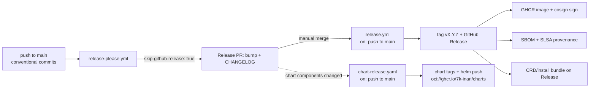

# Release process

inari-operator uses **release-please in PR-only mode** (release-type `go`). There are no tag-push triggers anywhere in this repo.

## Flow

## Helm charts

This repo also releases two Helm charts from `charts/`:

- `charts/inari-operator-crds` — verbatim CRDs from `config/crd/bases`
  (synced by `make chart-crds`, drift-checked in CI).
- `charts/inari-operator` — the controller Deployment/RBAC/ServiceAccount.

Both are release-please components (release-type `simple`, per-chart tags
`inari-operator-chart-vX.Y.Z` / `inari-operator-crds-vX.Y.Z`) sharing the
Release PR with the root go component. `.github/workflows/chart-release.yaml`
runs on push to main, detects released chart paths, and publishes
`oci://ghcr.io/7k-inari/charts/<name>:<version>`. It shares the
`release-main` concurrency group with `release.yml` so the two release-please
detections serialize — the second run sees the releases already created.

Version sync: the root go component's release-please `extra-files` (yaml
updaters) bump `appVersion` in both charts' `Chart.yaml` whenever an operator
release is cut, so the charts' appVersion always records the operator image
they ship/generated from. Chart `version:` stays independent — never bump it
by hand. Install order and cluster migration: `docs/helm-migration.md`.

1. Merge conventional-commit changes to `main`. `.github/workflows/release-please.yml` runs `googleapis/release-please-action` with `skip-github-release: true` and only opens/updates the Release PR (version bump + `CHANGELOG.md`).
2. A maintainer merges the Release PR — this is the manual release gate.
3. `.github/workflows/release.yml` (also `on: push` to main) is gated to release-please merge commits (`chore(main): release ...`) and runs release-please with `skip-github-pull-request: true`; it creates the tag `vX.Y.Z` and the GitHub Release, exposing `release_created`/`tag_name`/`version` outputs. Without this gate, manifest mode would release on every push carrying conventional commits, bypassing the manual PR gate.
4. Publish jobs run only when `release_created == 'true'`:
   - **image**: builds and pushes `ghcr.io/7k-inari/inari-operator:<version>` and `:latest`, signs keyless with cosign (OIDC), generates an SBOM (syft) and attaches SLSA build provenance (`actions/attest-build-provenance`).
   - **crd-bundle**: renders `config/crd` and `config/default` with kustomize and attaches `inari-operator-crds.yaml` / `inari-operator-install.yaml` to the Release.

## Files

| File | Purpose |
|------|---------|
| `release-please-config.json` | release-type `go` root package + `simple` chart components, changelog sections |
| `.release-please-manifest.json` | current released versions (root + charts) |
| `.github/workflows/release-please.yml` | Release PR only (`skip-github-release: true`) |
| `.github/workflows/release.yml` | tag + Release + image/bundle publish on Release-PR merge |
| `.github/workflows/chart-release.yaml` | per-chart tags + OCI chart publish on Release-PR merge |

Workflow permissions: `contents: write`, `packages: write`, `id-token: write`, `attestations: write` — all via the default `GITHUB_TOKEN`, no PAT.

## Edge images

Per-commit edge images (`ghcr.io/7k-inari/inari-operator:edge-<sha>`) are published by `.github/workflows/ci.yml` on merges to main (unsigned, no SBOM — the signed release path is exclusively the pipeline above). Nothing here reacts to tag pushes.

## Operator scaffold

The Go module, Dockerfile and `config/` manifests exist; the publish jobs' `hashFiles` gates are live. `make manifests` regenerates CRDs/RBAC with controller-gen before tagging a release.
