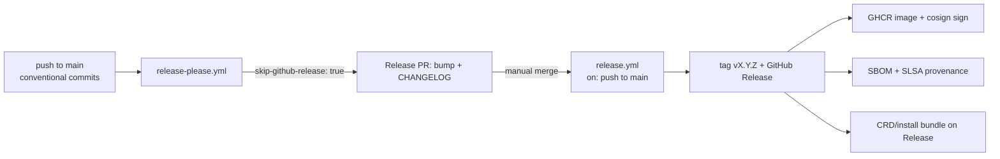

# Release process

inari-operator uses **release-please in PR-only mode** (release-type `go`). There are no tag-push triggers anywhere in this repo.

## Flow

1. Merge conventional-commit changes to `main`. `.github/workflows/release-please.yml` runs `googleapis/release-please-action` with `skip-github-release: true` and only opens/updates the Release PR (version bump + `CHANGELOG.md`).
2. A maintainer merges the Release PR — this is the manual release gate.
3. `.github/workflows/release.yml` (also `on: push` to main) is gated to release-please merge commits (`chore(main): release ...`) and runs release-please with `skip-github-pull-request: true`; it creates the tag `vX.Y.Z` and the GitHub Release, exposing `release_created`/`tag_name`/`version` outputs. Without this gate, manifest mode would release on every push carrying conventional commits, bypassing the manual PR gate.
4. Publish jobs run only when `release_created == 'true'`:
   - **image**: builds and pushes `ghcr.io/7k-inari/inari-operator:<version>` and `:latest`, signs keyless with cosign (OIDC), generates an SBOM (syft) and attaches SLSA build provenance (`actions/attest-build-provenance`).
   - **crd-bundle**: renders `config/crd` and `config/default` with kustomize and attaches `inari-operator-crds.yaml` / `inari-operator-install.yaml` to the Release.

## Files

| File | Purpose |
|------|---------|
| `release-please-config.json` | release-type `go`, package, changelog sections |
| `.release-please-manifest.json` | current released version |
| `.github/workflows/release-please.yml` | Release PR only (`skip-github-release: true`) |
| `.github/workflows/release.yml` | tag + Release + publish on Release-PR merge |

Workflow permissions: `contents: write`, `packages: write`, `id-token: write`, `attestations: write` — all via the default `GITHUB_TOKEN`, no PAT.

## Edge images

Per-commit edge images (`ghcr.io/7k-inari/inari-operator:edge-<sha>`) are published by a separate CI workflow (M3-W1) and are intentionally **not** part of this pipeline; nothing here reacts to tag pushes.

## Pending (until operator code lands / M3-W1)

The repo currently has no Go module, Dockerfile, or `config/` manifests. The publish jobs are gated (`hashFiles('go.mod')`, `hashFiles('Dockerfile')`, `hashFiles('config/crd/kustomization.yaml')`) and will no-op until those land. Release-PR + tag/Release creation works today; image/SBOM/SLSA/CRD-bundle verification is **pending** the operator scaffold.
